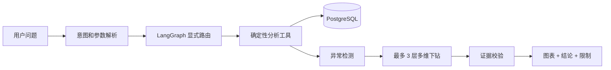
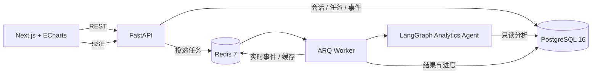

# ShopPulse — 电商经营分析与决策 Agent

> 用一句自然语言问题，完成电商指标查询、异常检测、多维归因和经营建议，并通过 Web 界面实时展示分析过程。

ShopPulse 是一个面向电商运营场景的全栈 Agent 应用。用户可以直接询问“为什么最近南区退款率上升？”或“生成本周经营周报”，系统会解析意图、调用可验证的分析工具、限制异常归因深度，最终返回带数据证据和可视化图表的结果。

## 个人实现重点

- 设计 PostgreSQL 电商数据模型、Alembic 迁移、可复现数据生成器和数据质量校验。
- 实现 KPI、RFM、Cohort、行为漏斗、异常检测、多维归因、库存预警和商品关联分析。
- 使用 LangGraph 编排可控分析流程，加入工具调用上限、下钻深度、证据校验和无模型降级。
- 搭建 FastAPI + ARQ + Redis + SSE 的异步服务，实现幂等提交、任务重试、超时恢复和事件补发。
- 完成 Next.js + ECharts 可视化界面，并建立 72 条样本的本地评测和自动化测试。

## 项目能解决什么

- **KPI 趋势**：GMV、订单量、客单价、净销售额、毛利率、退款率和支付转化率。
- **用户与留存**：RFM 用户分群、Cohort 留存分析、行为漏斗。
- **异常与归因**：使用滚动中位数与 MAD 检测异常，再按地区、渠道、品类等维度有界下钻。
- **运营决策**：库存预警、商品关联分析和自动经营周报。
- **完整应用链路**：异步任务、SSE 实时事件、任务取消与重试、历史会话、ECharts 图表。

## 一次分析是怎样完成的



Agent 采用显式 StateGraph，而不是让模型自由循环调用工具。异常归因最多下钻 3 层、整个过程最多 8 次工具调用，避免无限循环和成本失控。LLM 只负责结构化理解和表达；经营指标、异常算法和归因证据均来自确定性 Python/SQL 计算。没有模型 API Key 时，系统仍能使用规则降级完成分析。

## 系统架构



| 层 | 技术 | 主要职责 |
|---|---|---|
| Agent | LangGraph、LangChain | 意图识别、显式路由、有界下钻、证据校验 |
| 指标层 | Python、SQLAlchemy、SQLGlot | 指标口径、RFM、Cohort、漏斗、异常、归因 |
| 服务层 | FastAPI、ARQ、Redis | REST API、异步执行、SSE、幂等、重试 |
| 数据层 | PostgreSQL、Alembic | 经营事实数据、会话、任务、事件和评测结果 |
| 前端 | Next.js、React、ECharts | 问题提交、进度流、结果解读和多类图表 |

## 值得关注的工程设计

- **可验证，不凭空生成**：数值从数据库计算，最终回答携带证据、警告和限制。
- **指标口径集中管理**：订单、退款、明细和事件先聚合后组合，避免 Join 放大。
- **只读与数据安全**：动态维度使用白名单，SQL 使用绑定参数，Agent 不暴露 DDL/DML 工具，默认不返回客户 PII。
- **可恢复的异步任务**：先持久化任务再入队，通过幂等键防重，lease 超时后可重新投递。
- **实时但不丢历史**：Redis 负责实时流，PostgreSQL 保存完整事件；SSE 重连可通过 `Last-Event-ID` 补发。
- **可量化评测**：72 条无隐私样本覆盖 8 类分析，统计意图、工具、SQL、数值、方向、归因、证据、延迟和成本等指标。

## 快速启动

需要 Docker Desktop 和 Docker Compose。LLM 默认关闭，因此首次启动不需要任何模型密钥。

```bash
git clone https://github.com/songyaalii-cpu/ShopPulse-Agent.git
cd ShopPulse-Agent
cp .env.example .env
docker-compose up --build --wait
```

启动后访问：

- Web 应用：`http://localhost:3000`
- API 文档：`http://localhost:8000/docs`
- 健康检查：`http://localhost:8000/health/ready`

本地拆分开发和更多故障排查说明见 [`docs/phase-3-production-app.md`](docs/phase-3-production-app.md)。指标口径、异常检测与归因规则见 [`docs/phase-2-analytics-agent.md`](docs/phase-2-analytics-agent.md)。

## 示例问题

```text
最近 12 周 GMV、订单量和客单价趋势如何？
为什么最近 60 天南区退款率上升？
比较各渠道从浏览到支付的转化率。
对客户进行 RFM 分群。
哪些商品即将缺货？
生成最新完整周的经营周报。
```

## 测试

```bash
uv sync --frozen --group dev
uv run pytest -q
cd frontend && npm ci && npm test
```

本次公开版本本地验证：

- Python：42 passed，11 skipped（需要独立 PostgreSQL 测试库的集成用例）。
- Frontend：5 passed。
- GitHub Actions：默认运行无 API Key 的单元测试。

## 代码结构

```text
shoppulse/
├── agents/          # LangGraph 状态、节点、路由与提示词
├── analytics/       # KPI、RFM、Cohort、漏斗、异常、归因算法
├── api/             # FastAPI 路由、服务、序列化与中间件
├── db/              # SQLAlchemy 模型、会话和 SQL 安全
├── evals/           # 72 条评测数据与评测指标
├── observability/   # 结构化日志、Token 与成本统计
└── worker/          # ARQ 任务、事件、图表和执行器
frontend/            # Next.js + React + ECharts
migrations/          # Alembic 数据库迁移
tests/               # 单元、API、Worker 与 PostgreSQL 集成测试
docs/                # 数据平台、Agent 和生产化设计文档
```

## 局限与合规声明

- 演示环境使用 `X-Client-ID` 隔离会话，它不是正式登录鉴权；公网生产部署需接入真实身份和授权系统。
- 归因结果表示数据相关性和贡献度，不代表已证明因果关系。
- 项目使用合成电商数据，不包含真实客户信息。


